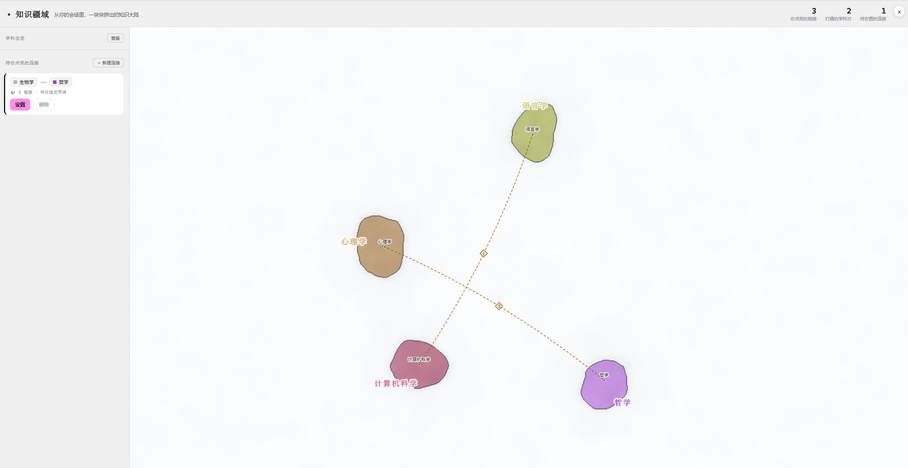

# 知识疆域

[English](README.md) | 中文

给 DeepSeek Harness (dsh) 的一张会生长的知识地图。学科是大陆,二级学科是大陆里的州,你确认过的连接落成大陆之间的桥。地图从一片空白的白海开始,只随你真正连过的东西生长——AI 提两端,你来安置。

<p align="center">
  
</p>

## 疆域怎么长

- **一套共享的学科总库。** 29 个一级学科——按维基百科《学科大纲》分成五大分支,各带二级学科——在地图、跨学科抽卡、AI 分类兜底之间共享同一套结构。「学科总览」面板把整个总库铺成色块:未开辟的淡显,点一下即落成大陆;点某个二级学科,在它的大陆里开出一片州。也可以自建学科。
- **桥与链接。** 桥 = 两个学科之间的一条连线;链接 = 桥上的一条条依据——抽卡的钩子句、一条笔记、从对话里提炼的一句、AI 提议的理由、或你手写的一句。桥上菱形里的数字是链接数;点开可以读链接、增删,或改指任一端(两端是可点选的 chip)。
- **进料口。** 抽一张跨学科卡、或记一笔,都可以「收进疆域」:先落到左栏当待安置的连接,AI 猜两端,你确认或改掉,再安置。卡片把那句钩子留在桥上;笔记带回链,从桥上的链接能跳回原笔记。
- **从对话找桥。** 左栏的「✦ 从对话找桥」读当前会话最近几轮(纯内存缓冲,绝不碰会话日志),提炼最多 3 座候选桥,每座带一句锚在对话原文上的理由。它们进预备队列,安置流程与其他来源相同。
- **探索模式。** 打开任意一座桥、定好两端,点「✨ 请 AI 想理由」:AI 给 3 条不同角度的具体理由(方法迁移/共同结构/历史渊源/具体案例)。点一条收进链接;没点的,面板一关就散了。
- **分享。** 「分享」按钮先预览将要离开你机器的全部内容,再导出两种产物:一个自包含网页(可交互的快照、每座桥的链接全文、内嵌 JSON 备份,不依赖服务器),和一张竖长图(地图在上、桥的游记在下),尺寸适合聊天软件。
- **顶部读数**:你点亮的链接数、打通的学科对数、还在等你的连接数。

最后一步——判定两个东西连得上——始终在你手里。你不安置,什么都不会落到图上。

## 里面有什么

| 包 | 作用 |
|---|---|
| [`dsh-plugin-atlas`](packages/atlas) | **知识疆域**——地图本体。学科大陆、二级学科的州、承载链接的桥。全屏,从浮条打开。 |
| [`dsh-plugin-crosslens`](packages/crosslens) | 跨学科抽卡——就当前话题抽一个"用别的学科的眼睛看"的线头,学科列表与地图同一套总库。抽到的卡可收进疆域。 |
| [`dsh-plugin-jiyibi`](packages/jiyibi) | 记一笔——用你自己的话写下某一刻对你意味着什么。可收进疆域;笔记本身留在可检索的私人账本里,桥上的链接能跳回来。 |
| [`dsh-plugin-pace-hub`](packages/pace-hub) | 可拖的浮条(名为「知识疆域」):置顶打开地图,承载跨学科抽卡与记一笔,并逐个开关工具。 |
| [`dsh-plugin-pace-skin`](packages/pace-skin) | 共享皮肤:一套 `--pp-*` 令牌,让全套看起来是一个东西。 |
| [`dsh-pace-popups`](packages/suite) | 套件 bundle。它的 `cordis.patch.yml` 是全套的标准挂载清单。 |
| [`dsh-plugin-grasp-probe`](packages/grasp-probe) | 停一下——当会话进度可能跑过你还能背书的范围时,在输入框上方浮一条淡提示。辅助功能,**默认关**,想用在浮条里打开。 |

## 设计约定

- **中英双语界面。** 所有工具跟随 dsh 的全局语言设置(设置 → 通用 → 语言,zh/en)。你自己的内容——笔记、学科名、卡片文字——保持你写下时的语言。
- **疆域是你机器上的一个文件。** 全部数据落在 `~/.dsh/atlas/territory.json`,重启不丢;导出的网页同时兼任可读备份。
- **AI 提议,你来连。** AI 猜的桥两端只是提案;你不确认,什么都不落图。
- **绝不写会话日志。** 每个插件走自己的内存态 Connection RPC 通道。
- **零构建。** 手写客户端工厂;`react` / `slots` / `connection` 是平台 external。

## 安装

dsh 按"已安装的包身份"解析插件,把本仓的插件装进你的 profile 即可。

```sh
# 1. 克隆
git clone https://github.com/xiayuhkust/knowledge-territory
cd knowledge-territory

# 2. 把插件加进 dsh profile(在本仓根目录里运行)
dsh plugin --profile web add \
  ./packages/pace-skin \
  ./packages/atlas \
  ./packages/crosslens \
  ./packages/jiyibi \
  ./packages/pace-hub \
  ./packages/grasp-probe
```

3. 挂载:把 [`packages/suite/cordis.patch.yml`](packages/suite/cordis.patch.yml) 里的 `- insert:` 行复制进你 profile 的 `cordis.patch.yml`(`pace-skin` 保持在最前)。

重启 `dsh web`。右下角出现浮条;点开,置顶的 **🗺️ 打开知识疆域** 进地图,或抽张卡 / 记一笔收进去。`dsh --profile web --dump-config` 可确认插件行已在。

只想要地图?第 2 步只加 `pace-skin`、`atlas`、`pace-hub` 三个包和它们的行——进料口是可选的,`grasp-probe` 反正默认也是关的。

## 约定

- 每个插件一个独立包,前缀 `dsh-plugin-*`;`dsh-pace-popups` bundle 把它们收拢在一起。仓库打 `dsh-plugin` GitHub topic。
- 插件是零构建、手写的客户端工厂;`react` / `slots` / `connection` 是平台 external。
- 后端 LLM 工作(抽卡、桥两端判定)走宿主的 `ctx.llm`;绝不写会话日志。

## License

[MIT](LICENSE)
