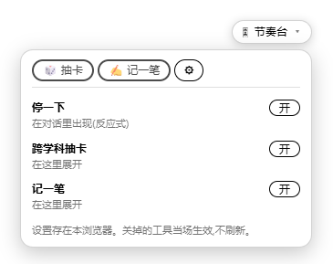
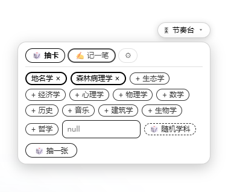
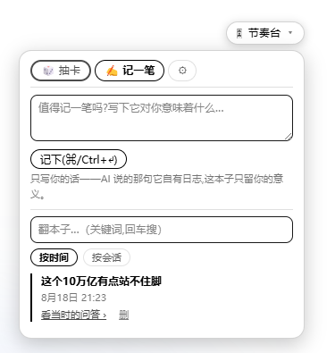

# dsh-pace-popups

[English](README.md) | 中文

面向用户的一组"调节奏"小弹窗,给 DeepSeek Harness (dsh)。每个只干一件事——帮**你**把手搭在 AI 会话的节奏上,然后让开。它们都停靠在一条浮在 app 之上、可拖动的浮条里;装一次就带全套,单个可在浮条里关掉。零构建、无额外运行时依赖,且都不写会话日志。面向 dsh 0.1.x 开发者预览,接口可能随 dsh 迭代变动。

<p align="center">
  
</p>

## 里面有什么

| 包 | 作用 |
|---|---|
| [`dsh-plugin-grasp-probe`](packages/grasp-probe) | 当会话进度可能已跑过你还能背书的范围时,在输入框上方浮一条淡提示,附一道自查题。反应式、可忽略。 |
| [`dsh-plugin-crosslens`](packages/crosslens) | 跨学科抽卡:选或随机一个学科,给当前话题一个"用别的学科的眼睛看"的线头。 |
| [`dsh-plugin-jiyibi`](packages/jiyibi) | 记一笔:用你自己的话,写下某一刻它对你意味着什么。标记那刻把当时的问答快照进一个可检索、活过会话的私人账本。 |
| [`dsh-plugin-pace-hub`](packages/pace-hub) | 承载上面这些工具、并逐个开关它们的浮条。挂在 app 级的 `shell.overlay` 槽。 |
| [`dsh-pace-popups`](packages/suite) | 套件 bundle——只装这一个包,即挂上全套。 |

## 截图

反应式的「停一下」(grasp-probe)浮在输入框上方,对齐到对话列:

<p align="center">
  
</p>

你主动打开的工具从浮条里展开:

<table>
  <tr>
    <td width="50%"></td>
    <td width="50%"></td>
  </tr>
  <tr>
    <td align="center"><em>跨学科抽卡——选或随机一个学科,再抽一张</em></td>
    <td align="center"><em>记一笔——记一笔、按时间/按会话翻本子、看当时的问答</em></td>
  </tr>
</table>

## 安装

```sh
dsh plugin --profile web add dsh-pace-popups
```

重启 `dsh web`。浮条出现;点开取用工具,或把某个关掉。`dsh --profile web --dump-config` 可确认插件行已在。

> 状态:尚未发布到 npm。在此之前,从源码安装(见下)。

## 从源码

本仓是一个 pnpm workspace。克隆后,把你的 dsh profile 指向想要的包——或加套件 bundle,或单独加那四个插件——并在 profile 的 `cordis.patch.yml` 里挂载。每个包都是独立的 `dsh-plugin-*` 单元,你也可以只取其一。

## 约定

- 每个插件一个独立 npm 包,前缀 `dsh-plugin-*`;`dsh-pace-popups` bundle 负责一次挂全套。仓库打 `dsh-plugin` GitHub topic。
- 插件是零构建、手写的客户端工厂;`react` / `slots` / `connection` 是平台 external,且不 import 任何 `@deepseek-ai/dsh-*`。
- 数据走各插件自己的内存态 Connection RPC 通道;绝不写会话日志。

## License

[MIT](LICENSE)
